<p align="center">
  
</p>

<h1 align="center">Shipwright</h1>

<p align="center">
  <strong>The Autonomous Delivery Platform</strong><br>
  From labeled GitHub issue to merged PR — zero human intervention.
</p>

<p align="center">
  <a href="https://github.com/sethdford/shipwright/actions/workflows/test.yml"></a>
  <a href="https://github.com/sethdford/shipwright/actions/workflows/shipwright-pipeline.yml"></a>
  
  
  
  
</p>

---

## Shipwright Builds Itself

This repo uses Shipwright to process its own issues. Label a GitHub issue with `shipwright` and the autonomous pipeline takes over: semantic triage, plan, design, build, test, review, quality gates, PR. No human in the loop.

**[See it live](../../actions/workflows/shipwright-pipeline.yml)** | **[Create an issue](../../issues/new?template=shipwright.yml)** and watch it build.

---

## How It Works

```mermaid
graph LR
    A[GitHub Issue] -->|labeled 'shipwright'| B[Daemon]
    B --> C[Triage & Score]
    C --> D[Select Template]
    D --> E[Pipeline]

    subgraph Pipeline ["12-Stage Pipeline"]
        direction LR
        E1[intake] --> E2[plan] --> E3[design] --> E4[build]
        E4 --> E5[test] --> E6[review] --> E7[quality]
        E7 --> E8[PR] --> E9[merge] --> E10[deploy]
        E10 --> E11[validate] --> E12[monitor]
    end

    E --> E1
    E12 --> F[Merged PR]

    subgraph Intelligence ["Intelligence Layer"]
        I1[Predictive Risk]
        I2[Model Routing]
        I3[Adversarial Review]
        I4[Self-Optimization]
    end

    Intelligence -.->|enriches| Pipeline

    style A fill:#00d4ff,color:#000
    style F fill:#4ade80,color:#000
```



When tests fail, the pipeline re-enters the build loop with error context — self-healing like a developer reading failures and fixing them. Convergence detection stops infinite loops. Error classification routes retries intelligently.

---

## Install

```bash
curl -fsSL https://raw.githubusercontent.com/sethdford/shipwright/main/scripts/install-remote.sh | bash
```

<details>
<summary>Other methods</summary>

**From source**

```bash
git clone https://github.com/sethdford/shipwright.git
cd shipwright && ./install.sh
```

**npm** (global)

```bash
npm install -g shipwright-cli
```

**Verify**

```bash
shipwright doctor
```

</details>

## Quick Start

```bash
# One-command setup
shipwright init

# Process a GitHub issue end-to-end
shipwright pipeline start --issue 42

# Watch GitHub and build autonomously 24/7
shipwright daemon start --detach

# Spin up a 3-agent team for manual work
shipwright session my-feature -t feature-dev

# Continuous build loop with test validation
shipwright loop "Build auth module" --test-cmd "npm test"
```

---

## Features

### 12-Stage Delivery Pipeline

```
intake → plan → design → build → test → review → compound_quality → pr → merge → deploy → validate → monitor
```

Each stage is configurable with quality gates that auto-proceed or pause for approval. 8 pipeline templates:

| Template     | Stages                            | Use Case                  |
| ------------ | --------------------------------- | ------------------------- |
| `fast`       | intake → build → test → PR        | Quick fixes, score >= 70  |
| `standard`   | + plan, review                    | Normal feature work       |
| `full`       | All 12 stages                     | Production deployment     |
| `hotfix`     | Minimal, all auto                 | Urgent production fixes   |
| `autonomous` | All stages, all auto              | Daemon-driven delivery    |
| `enterprise` | All stages, all gated             | Maximum safety + rollback |
| `cost-aware` | All stages + budget checks        | Budget-limited delivery   |
| `deployed`   | All + deploy + validate + monitor | Full deploy pipeline      |

### Intelligence Layer

7 modules that make the pipeline smarter over time. All optional, all degrade gracefully.

| Module                       | What It Does                                                                                                          |
| ---------------------------- | --------------------------------------------------------------------------------------------------------------------- |
| **Semantic Triage**          | AI-powered issue analysis, complexity scoring, template selection                                                     |
| **Pipeline Composer**        | Generates custom pipeline configs from codebase analysis (file churn, test coverage, dependencies)                    |
| **Predictive Risk**          | Scores issues for risk using GitHub signals (security alerts, similar past issues, contributor expertise)             |
| **Adversarial Review**       | Red-team code review — finds security flaws, edge cases, failure modes. Cross-checks against CodeQL/Dependabot alerts |
| **Self-Optimization**        | Reads DORA metrics and auto-tunes daemon config. Proportional template weighting, adaptive memory timescales          |
| **Developer Simulation**     | 3-persona review (security, performance, maintainability) before PR creation                                          |
| **Architecture Enforcement** | Living architectural model with violation detection and dependency direction rules                                    |

Adaptive everything: thresholds learn from history, model routing uses SPRT evidence-based switching, poll intervals adjust to queue depth, memory timescales tune based on fix effectiveness.

### GitHub Deep Integration

Native GitHub API integration enriches every intelligence module:

| API                   | Integration                                                                              |
| --------------------- | ---------------------------------------------------------------------------------------- |
| **GraphQL**           | File change frequency, blame data, contributor expertise, similar issues, commit history |
| **Checks API**        | Native check runs per pipeline stage — visible in PR timeline, blocks merges on failure  |
| **Deployments API**   | Tracks deployments per environment (staging/prod), rollback support, deployment history  |
| **Security**          | CodeQL + Dependabot alerts feed into risk scoring and adversarial review                 |
| **Contributors**      | CODEOWNERS-based reviewer routing, top-contributor fallback, auto-approve as last resort |
| **Branch Protection** | Checks required reviews and status checks before attempting auto-merge                   |

### Autonomous Daemon

```bash
shipwright daemon start --detach
```

Watches GitHub for labeled issues and processes them 24/7:

- **Auto-scaling**: Adjusts worker count based on CPU, memory, budget, and queue depth
- **Priority lanes**: Reserve a worker slot for urgent/hotfix issues
- **Retry with escalation**: Failed builds retry with template escalation (fast → standard → full)
- **Patrol mode**: Proactively scans for security issues, stale deps, dead code, coverage gaps
- **Self-optimization**: Tunes its own config based on DORA metrics over time

### Fleet Operations

```bash
shipwright fleet start
```

Orchestrate daemons across multiple repositories with a shared worker pool. Workers rebalance based on queue depth, issue complexity, and repo priority.

### Persistent Memory

The pipeline learns from every run:

- **Failure patterns**: Captured and injected into future builds so agents don't repeat mistakes
- **Fix effectiveness**: Tracks which fixes actually resolved issues
- **Prediction validation**: Compares predicted risk against actual outcomes, auto-adjusts thresholds
- **False-alarm tracking**: Reduces noise by learning which anomalies are real

### Cost Intelligence

```bash
shipwright cost show
```

Per-pipeline cost tracking with model pricing, budget enforcement, and ROI analysis. Adaptive model routing picks the cheapest model that meets quality targets.

### Real-Time Dashboard

```bash
shipwright dashboard start
```

Web dashboard with live pipeline progress, GitHub context (security alerts, contributors, deployments), DORA metrics, and cost tracking. WebSocket-powered, updates in real-time.

---

## Commands

| Command                                   | Purpose                          |
| ----------------------------------------- | -------------------------------- |
| `shipwright init`                         | One-command tmux setup           |
| `shipwright setup`                        | Guided setup wizard              |
| `shipwright pipeline start --issue N`     | Full delivery pipeline for issue |
| `shipwright pipeline start --goal "..."`  | Pipeline from goal description   |
| `shipwright pipeline resume`              | Resume from last checkpoint      |
| `shipwright daemon start`                 | Watch GitHub for labeled issues  |
| `shipwright daemon start --detach`        | Background daemon in tmux        |
| `shipwright daemon metrics`               | DORA/DX metrics dashboard        |
| `shipwright fleet start`                  | Multi-repo daemon orchestration  |
| `shipwright fix "goal" --repos ~/a,~/b`   | Apply same fix across repos      |
| `shipwright loop "goal" --test-cmd "..."` | Continuous autonomous loop       |
| `shipwright session name -t template`     | Create team session with agents  |
| `shipwright memory show`                  | View persistent memory           |
| `shipwright cost show`                    | Token usage and spending         |
| `shipwright cost budget set 50`           | Set daily budget limit           |
| `shipwright prep`                         | Analyze repo, generate configs   |
| `shipwright doctor`                       | Validate setup, diagnose issues  |
| `shipwright status`                       | Team dashboard                   |
| `shipwright ps`                           | Running agent processes          |
| `shipwright logs team --follow`           | Tail agent logs                  |
| `shipwright github context`               | Show repo GitHub context         |
| `shipwright github security`              | CodeQL + Dependabot alerts       |
| `shipwright checks list`                  | GitHub Check runs                |
| `shipwright deploys list`                 | Deployment history               |
| `shipwright intelligence`                 | Run intelligence analysis        |
| `shipwright predict`                      | Risk assessment                  |
| `shipwright optimize`                     | Self-optimization pass           |
| `shipwright dashboard`                    | Start web dashboard              |
| `shipwright cleanup --force`              | Kill orphaned sessions           |
| `shipwright upgrade --apply`              | Pull latest updates              |

## Pipeline Templates for Teams

24 team templates covering the full SDLC:

```bash
shipwright templates list
```

## Configuration

| File                          | Purpose                                            |
| ----------------------------- | -------------------------------------------------- |
| `.claude/daemon-config.json`  | Daemon settings, intelligence flags, patrol config |
| `.claude/pipeline-state.md`   | Current pipeline state                             |
| `templates/pipelines/*.json`  | 8 pipeline template definitions                    |
| `tmux/templates/*.json`       | 24 team composition templates                      |
| `~/.shipwright/events.jsonl`  | Event log for metrics                              |
| `~/.shipwright/costs.json`    | Cost tracking data                                 |
| `~/.shipwright/budget.json`   | Budget limits                                      |
| `~/.shipwright/github-cache/` | Cached GitHub API responses                        |

## Prerequisites

| Requirement     | Version | Install                                |
| --------------- | ------- | -------------------------------------- |
| tmux            | 3.2+    | `brew install tmux`                    |
| jq              | any     | `brew install jq`                      |
| Claude Code CLI | latest  | `npm i -g @anthropic-ai/claude-code`   |
| Node.js         | 20+     | For hooks and dashboard                |
| Git             | any     | For installation                       |
| gh CLI          | any     | `brew install gh` (GitHub integration) |

## Architecture

37 bash scripts (~35K lines), 20 test suites (320+ tests), plus a Bun TypeScript dashboard server. Bash 3.2 compatible — runs on macOS out of the box.

```
scripts/
  sw                          # CLI router
  sw-pipeline.sh              # 12-stage delivery pipeline
  sw-daemon.sh                # Autonomous issue watcher
  sw-loop.sh                  # Continuous build loop
  sw-intelligence.sh          # AI analysis engine
  sw-predictive.sh            # Risk scoring + anomaly detection
  sw-adversarial.sh           # Red-team code review
  sw-self-optimize.sh         # DORA-driven self-tuning
  sw-pipeline-composer.sh     # Dynamic pipeline generation
  sw-github-graphql.sh        # GitHub GraphQL client
  sw-github-checks.sh         # Native CI check runs
  sw-github-deploy.sh         # Deployment tracking
  sw-fleet.sh                 # Multi-repo orchestration
  sw-memory.sh                # Persistent learning
  sw-cost.sh                  # Cost intelligence
  ...                         # 22 more scripts
dashboard/
  server.ts                   # Bun WebSocket dashboard (4300+ lines)
  public/                     # Dashboard frontend
```

## Contributing

**Let Shipwright build it:** Create an issue using the [Shipwright template](../../issues/new?template=shipwright.yml) and label it `shipwright`. The autonomous pipeline will triage, plan, build, test, review, and create a PR.

**Manual development:** Fork, branch, then:

```bash
npm test    # 320+ tests across 20 suites
```

## License

MIT — Seth Ford, 2026.
