<p align="center">
  
</p>

<h1 align="center">Shipwright</h1>

<p align="center">
  <strong>The Autonomous Delivery Platform</strong><br>
  From labeled GitHub issue to merged PR — with 18 new autonomous agents orchestrating every step.
</p>

<p align="center">
  <a href="https://github.com/sethdford/shipwright/actions/workflows/test.yml"></a>
  <a href="https://github.com/sethdford/shipwright/actions/workflows/shipwright-pipeline.yml"></a>
  
  
  
  
</p>

---

## Shipwright Builds Itself

This repo uses Shipwright to process its own issues. Label a GitHub issue with `shipwright` and the autonomous pipeline takes over: semantic triage, plan, design, build, test, review, quality gates, PR. No human in the loop.

**[See it live](../../actions/workflows/shipwright-pipeline.yml)** | **[Create an issue](../../issues/new?template=shipwright.yml)** and watch it build.

---

## What's New in v2.0.0

**18 new autonomous agents** bringing intelligent orchestration to every phase:

- **Agent Swarm** — Dynamic multi-agent coordination with role specialization
- **Autonomous PM** — Team orchestration, task scheduling, roadmap management
- **Knowledge Guilds** — Cross-team learning and pattern discovery
- **Quality Oversight** — Intelligent completion audits and zero-defect gates
- **Strategic Intelligence** — Long-term planning and goal decomposition
- **Adaptive Pipeline** — Data-driven tuning based on historical performance
- **Live Activity Streams** — Real-time agent work visualization
- **Incident Response** — Autonomous detection, triage, and resolution
- **Dependency Management** — Automated updates with semantic versioning
- **100+ CLI Commands** — Unified command surface for all operations
- **Multi-Repo Fleet Orchestration** — Distribute work across teams and repositories
- **Local Mode** — Full pipeline capability without GitHub (for development/testing)

**v1.13.0 features**:
- **Webhook receiver** — Zero-latency issue processing
- **PR lifecycle automation** — Auto-review, merge, cleanup
- **Fleet auto-discovery** — Populate fleet config from GitHub org
- **SQLite persistence** — ACID-safe state, crash recovery
- **Issue decomposition** — AI-split complex features
- **systemd support** — Cross-platform process supervision
- **Context engine** — Rich context injection

---

## How It Works

```mermaid
graph LR
    A[GitHub Issue] -->|labeled 'shipwright'| B[Daemon]
    B --> C[Triage & Score]
    C --> D[Select Template]
    D --> E[Pipeline]

    subgraph Pipeline ["12-Stage Pipeline"]
        direction LR
        E1[intake] --> E2[plan] --> E3[design] --> E4[build]
        E4 --> E5[test] --> E6[review] --> E7[quality]
        E7 --> E8[PR] --> E9[merge] --> E10[deploy]
        E10 --> E11[validate] --> E12[monitor]
    end

    E --> E1
    E12 --> F[Merged PR]

    subgraph Intelligence ["Intelligence Layer"]
        I1[Predictive Risk]
        I2[Model Routing]
        I3[Adversarial Review]
        I4[Self-Optimization]
    end

    Intelligence -.->|enriches| Pipeline

    style A fill:#00d4ff,color:#000
    style F fill:#4ade80,color:#000
```



When tests fail, the pipeline re-enters the build loop with error context — self-healing like a developer reading failures and fixing them. Convergence detection stops infinite loops. Error classification routes retries intelligently.

---

## Install

```bash
curl -fsSL https://raw.githubusercontent.com/sethdford/shipwright/main/scripts/install-remote.sh | bash
```

<details>
<summary>Other methods</summary>

**From source**

```bash
git clone https://github.com/sethdford/shipwright.git
cd shipwright && ./install.sh
```

**npm** (global)

```bash
npm install -g shipwright-cli
```

**Verify**

```bash
shipwright doctor
```

</details>

## Quick Start

```bash
# One-command setup
shipwright init

# See what's running
shipwright status

# Process a GitHub issue end-to-end
shipwright pipeline start --issue 42

# Run daemon 24/7 with agent orchestration
shipwright daemon start --detach

# See live agent activity
shipwright activity

# Spin up agent team for manual work
shipwright session my-feature -t feature-dev

# View DORA metrics and pipeline vitals
shipwright dora

# Continuous build loop with test validation
shipwright loop "Build auth module" --test-cmd "npm test"

# Multi-repo operations
shipwright fleet start
shipwright fix "upgrade deps" --repos ~/a,~/b,~/c

# Release automation
shipwright release --version 2.1.0
shipwright changelog generate
```

---

## Features

### 18 Autonomous Agents

Wave 1 (Organizational):
- **Swarm Manager** — Orchestrates dynamic agent teams with specialization roles
- **Autonomous PM** — Team leadership, task scheduling, roadmap execution
- **Knowledge Guild** — Cross-team learning, pattern capture, mentorship
- **Recruitment System** — Talent acquisition and team composition
- **Standup Automaton** — Daily standups, progress tracking, blocker detection

Wave 2 (Operational Backbone):
- **Quality Oversight** — Intelligent audits, zero-defect gates, completeness verification
- **Strategic Agent** — Long-term planning, goal decomposition, roadmap intelligence
- **Code Reviewer** — Architecture analysis, clean code standards, best practices
- **Security Auditor** — Vulnerability detection, threat modeling, compliance
- **Test Generator** — Coverage analysis, scenario discovery, regression prevention
- **Incident Commander** — Autonomous triage, root cause analysis, resolution
- **Dependency Manager** — Semantic versioning, update orchestration, compatibility checking
- **Release Manager** — Release planning, changelog generation, deployment orchestration
- **Adaptive Tuner** — DORA metrics analysis, self-optimization, performance tuning
- **Strategic Intelligence** — Predictive analysis, trend detection, proactive recommendations

Plus 10+ specialized agents for observability, UX, documentation, and more.

### 12-Stage Delivery Pipeline

```
intake → plan → design → build → test → review → compound_quality → pr → merge → deploy → validate → monitor
```

Each stage is configurable with quality gates that auto-proceed or pause for approval. 8 pipeline templates:

| Template     | Stages                            | Use Case                  |
| ------------ | --------------------------------- | ------------------------- |
| `fast`       | intake → build → test → PR        | Quick fixes, score >= 70  |
| `standard`   | + plan, review                    | Normal feature work       |
| `full`       | All 12 stages                     | Production deployment     |
| `hotfix`     | Minimal, all auto                 | Urgent production fixes   |
| `autonomous` | All stages, all auto              | Daemon-driven delivery    |
| `enterprise` | All stages, all gated             | Maximum safety + rollback |
| `cost-aware` | All stages + budget checks        | Budget-limited delivery   |
| `deployed`   | All + deploy + validate + monitor | Full deploy pipeline      |

### Intelligence Layer

7 modules that make the pipeline smarter over time. All optional, all degrade gracefully.

| Module                       | What It Does                                                                                                          |
| ---------------------------- | --------------------------------------------------------------------------------------------------------------------- |
| **Semantic Triage**          | AI-powered issue analysis, complexity scoring, template selection                                                     |
| **Pipeline Composer**        | Generates custom pipeline configs from codebase analysis (file churn, test coverage, dependencies)                    |
| **Predictive Risk**          | Scores issues for risk using GitHub signals (security alerts, similar past issues, contributor expertise)             |
| **Adversarial Review**       | Red-team code review — finds security flaws, edge cases, failure modes. Cross-checks against CodeQL/Dependabot alerts |
| **Self-Optimization**        | Reads DORA metrics and auto-tunes daemon config. Proportional template weighting, adaptive memory timescales          |
| **Developer Simulation**     | 3-persona review (security, performance, maintainability) before PR creation                                          |
| **Architecture Enforcement** | Living architectural model with violation detection and dependency direction rules                                    |

Adaptive everything: thresholds learn from history, model routing uses SPRT evidence-based switching, poll intervals adjust to queue depth, memory timescales tune based on fix effectiveness.

### GitHub Deep Integration

Native GitHub API integration enriches every intelligence module:

| API                   | Integration                                                                              |
| --------------------- | ---------------------------------------------------------------------------------------- |
| **GraphQL**           | File change frequency, blame data, contributor expertise, similar issues, commit history |
| **Checks API**        | Native check runs per pipeline stage — visible in PR timeline, blocks merges on failure  |
| **Deployments API**   | Tracks deployments per environment (staging/prod), rollback support, deployment history  |
| **Security**          | CodeQL + Dependabot alerts feed into risk scoring and adversarial review                 |
| **Contributors**      | CODEOWNERS-based reviewer routing, top-contributor fallback, auto-approve as last resort |
| **Branch Protection** | Checks required reviews and status checks before attempting auto-merge                   |

### Autonomous Daemon

```bash
shipwright daemon start --detach
```

Watches GitHub for labeled issues and processes them 24/7:

- **Auto-scaling**: Adjusts worker count based on CPU, memory, budget, and queue depth
- **Priority lanes**: Reserve a worker slot for urgent/hotfix issues
- **Retry with escalation**: Failed builds retry with template escalation (fast → standard → full)
- **Patrol mode**: Proactively scans for security issues, stale deps, dead code, coverage gaps
- **Self-optimization**: Tunes its own config based on DORA metrics over time

### Fleet Operations

```bash
shipwright fleet start
```

Orchestrate daemons across multiple repositories with a shared worker pool. Workers rebalance based on queue depth, issue complexity, and repo priority.

### Persistent Memory

The pipeline learns from every run:

- **Failure patterns**: Captured and injected into future builds so agents don't repeat mistakes
- **Fix effectiveness**: Tracks which fixes actually resolved issues
- **Prediction validation**: Compares predicted risk against actual outcomes, auto-adjusts thresholds
- **False-alarm tracking**: Reduces noise by learning which anomalies are real

### Cost Intelligence

```bash
shipwright cost show
```

Per-pipeline cost tracking with model pricing, budget enforcement, and ROI analysis. Adaptive model routing picks the cheapest model that meets quality targets.

### Real-Time Dashboard

```bash
shipwright dashboard start
```

Web dashboard with live pipeline progress, GitHub context (security alerts, contributors, deployments), DORA metrics, and cost tracking. WebSocket-powered, updates in real-time.

### Webhook Receiver

```bash
shipwright webhook listen
```

Instant issue processing via GitHub webhooks instead of polling. Register webhook with `shipwright webhook register`, receive events in real-time, process issues with zero-lag.

### PR Lifecycle Automation

```bash
shipwright pr auto-review
shipwright pr merge
shipwright pr cleanup
```

Fully automated PR management: auto-review based on predictive risk and coverage, intelligent auto-merge when gates pass, cleanup stale branches. Reduces manual PR overhead by 90%.

### Fleet Auto-Discovery

```bash
shipwright fleet discover --org myorg
```

Scan a GitHub organization and auto-populate fleet config with all repos matching criteria (language, archived status, team ownership). One command instead of manual registry building.

### SQLite Persistence

ACID-safe state management replacing JSON files. Replaces volatile `.claude/pipeline-artifacts/` with reliable database schema. Atomic transactions ensure no partial states, crash recovery automatic.

### Issue Decomposition

```bash
shipwright decompose --issue 42
```

AI-powered issue analysis: auto-split complex features into manageable subtasks, create child issues with inherited labels/assignees, generate dependency graph for parallel execution.

### Linux systemd Support

Cross-platform process supervision. Use systemd on Linux instead of tmux, same daemon commands:

```bash
shipwright launchd install  # macOS launchd
# systemd service auto-generated on Linux
```

### Context Engine

```bash
shipwright context gather
```

Rich context injection for pipeline stages. Pulls together: contributor history, file hotspots, architecture rules, related issues, failure patterns. Injected automatically at each stage for smarter decisions.

---

## Commands

Over 100 commands in v2.0.0. Key workflows:

```bash
# Autonomous delivery
shipwright pipeline start --issue 42
shipwright daemon start --detach

# Agent teams
shipwright swarm list
shipwright recruit --roles builder,tester
shipwright standup
shipwright guild members

# Quality gates
shipwright code-review
shipwright security-audit
shipwright testgen
shipwright quality check

# Observability
shipwright vitals
shipwright dora
shipwright stream
shipwright activity

# Multi-repo operations
shipwright fleet start
shipwright fix "feat: add auth" --repos ~/a,~/b,~/c
shipwright fleet-viz

# Release automation
shipwright release --version 2.1.0
shipwright changelog generate
shipwright deploys list

# Setup & maintenance
shipwright init
shipwright prep
shipwright doctor
shipwright upgrade --apply

# See all commands
shipwright --help
```

See `.claude/CLAUDE.md` for the complete 100+ command reference organized by workflow.

## Pipeline Templates for Teams

24 team templates covering the full SDLC:

```bash
shipwright templates list
```

## Configuration

| File                          | Purpose                                            |
| ----------------------------- | -------------------------------------------------- |
| `.claude/daemon-config.json`  | Daemon settings, intelligence flags, patrol config |
| `.claude/pipeline-state.md`   | Current pipeline state                             |
| `templates/pipelines/*.json`  | 8 pipeline template definitions                    |
| `tmux/templates/*.json`       | 24 team composition templates                      |
| `~/.shipwright/events.jsonl`  | Event log for metrics                              |
| `~/.shipwright/costs.json`    | Cost tracking data                                 |
| `~/.shipwright/budget.json`   | Budget limits                                      |
| `~/.shipwright/github-cache/` | Cached GitHub API responses                        |

## Prerequisites

| Requirement     | Version | Install                                |
| --------------- | ------- | -------------------------------------- |
| tmux            | 3.2+    | `brew install tmux`                    |
| jq              | any     | `brew install jq`                      |
| Claude Code CLI | latest  | `npm i -g @anthropic-ai/claude-code`   |
| Node.js         | 20+     | For hooks and dashboard                |
| Git             | any     | For installation                       |
| gh CLI          | any     | `brew install gh` (GitHub integration) |

## Architecture

95+ bash scripts (~100K lines), 27 test suites (500+ tests), plus a TypeScript dashboard server. Bash 3.2 compatible — runs on macOS and Linux out of the box.

**Core Layers:**

```
Pipeline Layer
  sw-pipeline.sh              # 12-stage delivery orchestration
  sw-daemon.sh                # Autonomous GitHub issue watcher
  sw-loop.sh                  # Continuous multi-iteration build loop

Agent Layer (18 new in v2.0.0)
  sw-swarm.sh                 # Dynamic agent team orchestration
  sw-pm.sh                    # Autonomous PM coordination
  sw-recruit.sh               # Agent recruitment system
  sw-standup.sh               # Daily team standups
  sw-guild.sh                 # Knowledge guilds
  sw-oversight.sh             # Quality oversight board
  sw-strategic.sh             # Strategic intelligence
  sw-scale.sh                 # Dynamic team scaling
  ... 10 more agent scripts

Intelligence Layer
  sw-intelligence.sh          # AI analysis engine
  sw-predictive.sh            # Risk scoring + anomaly detection
  sw-adaptive.sh              # Data-driven pipeline tuning
  sw-security-audit.sh        # Security analysis
  sw-code-review.sh           # Code quality analysis
  sw-testgen.sh               # Test generation
  sw-architecture.sh          # Architecture enforcement

Operational Layer
  sw-fleet.sh                 # Multi-repo orchestration
  sw-ci.sh                    # CI/CD orchestration
  sw-webhook.sh               # GitHub webhooks
  sw-incident.sh              # Incident response
  sw-release-manager.sh       # Release automation
  ... 20+ operational scripts

Observability Layer
  sw-vitals.sh                # Pipeline health scoring
  sw-dora.sh                  # DORA metrics dashboard
  sw-activity.sh              # Live activity streams
  sw-replay.sh                # Pipeline playback
  sw-trace.sh                 # E2E traceability
  sw-otel.sh                  # OpenTelemetry integration
  ... observability services

Infrastructure
  sw-github-graphql.sh        # GitHub GraphQL API client
  sw-github-checks.sh         # Native GitHub check runs
  sw-github-deploy.sh         # Deployment tracking
  sw-memory.sh                # Persistent learning system
  sw-cost.sh                  # Cost intelligence
  sw-db.sh                    # SQLite persistence
  sw-eventbus.sh              # Async event bus

Tools & UX
  dashboard/server.ts         # Real-time dashboard
  sw-session.sh               # tmux agent sessions
  sw-status.sh                # Team dashboard
  sw-docs.sh                  # Documentation sync
  sw-tmux.sh                  # tmux health management
```

## Contributing

**Let Shipwright build it:** Create an issue using the [Shipwright template](../../issues/new?template=shipwright.yml) and label it `shipwright`. The autonomous pipeline will triage, plan, build, test, review, and create a PR.

**Manual development:** Fork, branch, then:

```bash
npm test    # 450+ tests across 24 suites
```

## License

MIT — Seth Ford, 2026.
